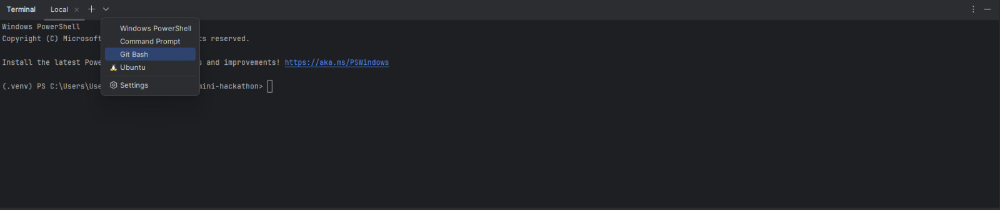
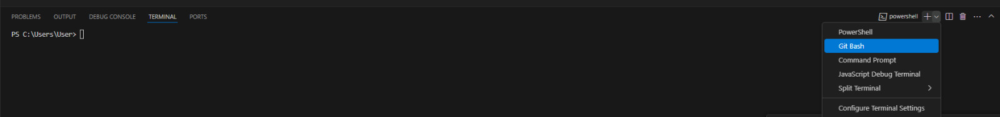

# Setup (only needed **ONCE**)

## Checklist: Ensure the Following Are Installed
1. **Python version 3.11 or newer** (check using `python --version`).
2. **Git** (download from [git-scm.com](https://git-scm.com)).
3. **An IDE** such as **VSCode** or **Pycharm**.

If any of the above is missing, please install them before proceeding.

---

## Configure Git Bash as Your Terminal in the IDE

Git Bash is a Unix-like terminal application bundled with Git installation. It simplifies running Unix commands for cloning, installing, or managing projects.

### For Pycharm Users
1. Open Pycharm with an empty project.
2. Click the **dropdown button** in the terminal to change the terminal type.
3. Select **git bash** from the list.


### For VSCode Users
1. Open VSCode.
2. `view` -> `terminal`
3. Click the **dropdown part of the _plus_ button** in the terminal.
4. Select **git bash**.

---

## Clone The Repository

As you already have an empty project opened in your IDE and selected git bash as your terminal emulator you're now ready to go for getting the code on
your computer.

1. Fork this repository by putting the command into your `git bash terminal` opened in your IDE.
> Note: [How to fork a repository](https://docs.github.com/en/get-started/quickstart/fork-a-repo)
2. [Make sure you have `git bash` in your IDE available.](#windows-user-git-bash-as-terminal-in-ide)
3. **How to determine where the repository should be stored?**
 - use the `cd` command to move up to the directory in your file system where the repo should be cloned.
 - the `mkdir` command creates a new folder. We use this to create a dedicated place where the repository should go.
 - Example:

```bash
# Start at the root directory (Git Bash uses /c/ to represent the C: drive)
  cd /c/Users/<Your-Username>          # Move into your user directory
  mkdir python-quiz-app                # Create a new folder for the project
  cd python-quiz-app                   # Move into the new folder

# Clone your forked repository into this folder
  git clone <repository-url>
 ```

> INFO: You can copy-paste this commands or follow the order and set a custom path.

## Open the cloned project in your IDE

> ATTENTION: Do not close git bash to save navigating back to the projects location.

### For pycharm users

It will ask you if you would like to create a virtual-environment by default.
This is usually initialized as `.venv` and you'll directly see it in your project structure if you follow the steps.

**Go back into the IDEs `git bash terminal` after setting up the default virtual environment.**

**Run**:
```bash
# Step 1: activate the virtual environment if not yet activated
# WINDOWS
<name_of_venv>/Scripts/activate
# Step 3: Check the python version
python --version
# Step 4: if python version is less than 3.13, else _be happy_
rm -rf <name_of_venv>
```

### For VSCode users

Just continue to the [next section (running the setup script)](#run-the-setup-script).

## Run The Setup-Script

SO, as the project is now cloned we proceed in the `git bash terminal`.

Before we can start the implementation we quickly need to install all the necessary software. With `software` we mean
the required python-packages for running the application.

- **IDE Git Bash:**
```bash
python setup.py
 ```

-----
## Troubleshooting
### Allow Script Execution (if Necessary)

In some cases, you may need to allow script execution on your system. If you encounter errors related to script execution, follow these steps:

1. Open **Git Bash** or **PowerShell** as an **administrator**.
2. Run the following command to check the current execution policy:
   ```bash
   Get-ExecutionPolicy
   ```
3. If the policy is restrictive (e.g., `Restricted`), temporarily change it to allow scripts:
   ```bash
   Set-ExecutionPolicy -Scope Process -ExecutionPolicy Bypass
   ```
   This allows script execution for the current session only.
---
